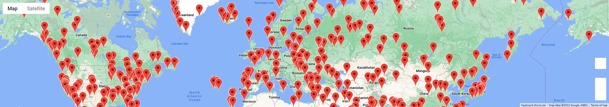
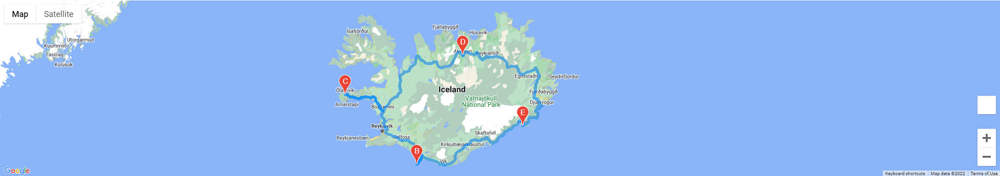
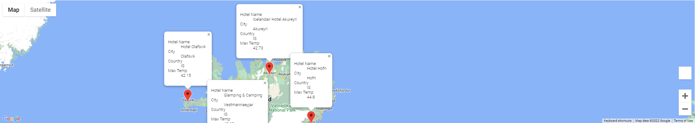

# World_Weather_Analysis

# Overview

- Many people want to travle the world and see new sights. 
- Weather conditions influence travel behavior and impact overall travel experience. 

# Purpose
- The purpose of this project is to collect, analyze and visualize weather data across cities worldwide and to provide travelers with a tool that will allow them to determine their travel destination based on weather conditions.

## Resources Used

    - CSV Files: Weather_Database.csv, WeatherPy_vacation.csv

    - Jupyter Notebook Files:: Weather_Database.ipynb, Vacation_Search.ipynb, Vacation_Itinerary.ipynb

    - Python: Python v3.7.6, Dependencies: Pandas, Matplotlib, CitiPy, SciPy, Python Requests, APIs, JSON Traversals

### Vacation Search
- Based on traveler’s weather preferences, travelers can identify potential travel destinations and nearby hotels. The map showcases destinations using pop-up markers on a marker layer-map.

### Vacation Itinerary

Using the Google Directions API, a sample itinerary was created that shows the route between four cities in Iceland.

- Then the user can see hotel name, city, country and max temp.

